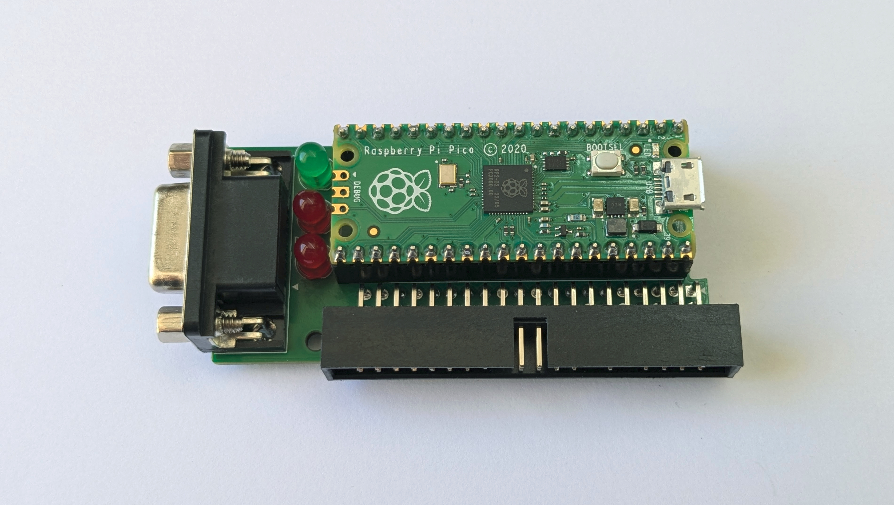

# PDP-11/05 Console Adapter

The *PDP-11/05 Console Adapter* is a hardware device which acts as a USB and RS-232 serial interface to the console of a [PDP-11/05](http://gunkies.org/wiki/PDP-11/05) minicomputer. The Console Adapter provides a number of useful features for working with the PDP-11/05:

- **Direct connection to the SCL connector on the back of the PDP-11/05**
- **USB-to-serial functionality, allowing access to the PDP-11 console from a modern terminal program**
- **Auxiliary RS-232 interface for connecting a real serial terminal**
- **External baud clock generator, allowing console data rates greater than 2400bps**
- **Dynamically adjustable serial data rate and format (110 to 38400 bps, 8-N-1, 7-E-1, 7-O-1)**
- **Virtual paper tape reader compatible with the 11/05's READER RUN signal**
- **M9301/M9312 console loader that can directly load data into the PDP-11's memory using console commands**

This version of the PDP-11/05 Console Adapter project (version 2) is based on the ubiquitous [Raspberry Pi Pico](https://www.raspberrypi.com/products/raspberry-pi-pico/) microcontroller. An earlier version based on the Teensy 3.2 microcontroller can be found [here](https://github.com/jaylogue/pdp-1105-console-usb-adapter).

### Project Status

**2025/04/28** - Significant progress has been made on the PDP-11/05 Console Adapter design and implementation. The schematic and PCB designs have been finalized and boards have been built and partially assembled. The firmware is functionally complete, but may undergo some further UI tweaks as documentation is developed. User documentation is underway, as are the designs for a set of 3D-printed enclosures.

**[How it Works](#how-it-works)** 
&nbsp;&nbsp;&nbsp;&nbsp;&nbsp;&nbsp;&nbsp;&nbsp;**[Console Interface](#console-interface)** 
&nbsp;&nbsp;&nbsp;&nbsp;&nbsp;&nbsp;&nbsp;&nbsp;**[Auxiliary Terminal Interface](#auxiliary-terminal-interface)** 
&nbsp;&nbsp;&nbsp;&nbsp;&nbsp;&nbsp;&nbsp;&nbsp;**[Baud Clock Generation](#baud-clock-generation)** 
&nbsp;&nbsp;&nbsp;&nbsp;&nbsp;&nbsp;&nbsp;&nbsp;**[Host Selectable Data Rate / Serial Format](#host-selectable-data-rate--serial-format)** 
&nbsp;&nbsp;&nbsp;&nbsp;&nbsp;&nbsp;&nbsp;&nbsp;**[Status LEDs](#status-leds)** 
&nbsp;&nbsp;&nbsp;&nbsp;&nbsp;&nbsp;&nbsp;&nbsp;**[Power Source](#power-source)** 
&nbsp;&nbsp;&nbsp;&nbsp;&nbsp;&nbsp;&nbsp;&nbsp;**[Virtual Paper Tape Reader](#virtual-paper-tape-reader)** 
&nbsp;&nbsp;&nbsp;&nbsp;&nbsp;&nbsp;&nbsp;&nbsp;**[M9301/M9312 Console Loader](#m9301m9312-console-loader)** 
&nbsp;&nbsp;&nbsp;&nbsp;&nbsp;&nbsp;&nbsp;&nbsp;**[On-device File Library](#on-device-file-library)** 
&nbsp;&nbsp;&nbsp;&nbsp;&nbsp;&nbsp;&nbsp;&nbsp;**[XMODEM File Upload](#xmodem-file-upload)** 
**[Schematic](#schematic)** 
**[PCB Design Files](#pcb-design-files)** 
**[User Documentation](#user-documentation)** 
**[License](#license)** 

## How it Works

### Console Interface

At the most basic level, the Console Adapter operates as a TTL-serial interface, connecting the PDP-11's console (also known as the Serial Communication Line or SCL port) to one of the Pico's internal UARTs. Level shifting circuitry in the adapter adjusts the PDP's 5V outputs to match the Pico's 3.3V inputs. Using USB software on the Pico, the adapter appears as a virtual COM port when connected to a host computer via USB, making it possible to use a standard terminal program (e.g. minicom, picocom or PuTTY) to interact with the PDP's console. In this way, the Console Adapter operates very similarly to an off-the-shelf USB-to-TTL serial device, with the exception that its behavior is fully customizable in software.

The Console Adapter supports standard serial data rates in the range accepted by the PDP-11 (110 to 38400 bps). Internally, the CPU in the PDP-11/05 is hard-wired to use the 8-N-1 serial format. However, with appropriate software support on the PDP side, 7-E-1 or 7-O-1 formats can also be used (other formats are not supported). Based on this, the Console Adapter limits the choice of serial formats to these three combinations.

### Baud Clock Generation

The PDP-11/05 CPU includes a clock generator circuit which is used to generate the 16X clock signal needed to drive the internal console UART chip. Due to its simplicity, the internal generator limits the maximum usable data rate to 2400 bps. Conveniently, the PDP-11/05 provides a way to override the internal generator by providing an external clock signal on the SCL port. This allows the console to run at substantially higher data rates (theoretically up to 40000 bps).

To enable higher data rates, the Console Adapter employs a PWM on the Pico to generate the necessary clock signal to drive the PDP’s UART. The frequency of this clock signal is automatically adjusted to match the data rate of the Pico's UART, ensuring that the two systems are always in sync.

### Auxiliary Terminal Interface

In addition to the host USB interface, the Console Adapter provides a second interface which can be used to connect a traditional serial terminal such as a VT-100. An RS-232 level shifter (MAX3232) is used to convert the signals to standard EIA levels, allowing most terminals of the era to be used. When connected, the terminal functions as an additional console for the PDP-11.

An auxiliary terminal can be used in parallel with a terminal program connected via USB. When operated this way, characters typed on either the host computer or the auxiliary terminal are forwarded to the PDP-11, while characters output by the PDP-11 appear simultaneously on both terminals. It is also possible to use the Console Adapter with just an auxiliary terminal connected (i.e. without a host USB connection).

The data rate and serial format for the auxiliary terminal can be set independently from that of the PDP-11's SCL port. (Although, since neither interface supports flow control, it is best to keep the data rates the same or similar between the two.)

### Host Selectable Data Rate / Serial Format

The Console Adapter appears to the host computer as a standard USB COM device. As such, it is able to receive and process standard USB requests to change the serial configuration (also known as CDC Line Coding requests). This makes it possible to adjust the adapter's serial data rate and format directly from within terminal software running on the host.

When the Console Adapter receives a Line Coding request it adjusts the configuration of the console UART and baud clock generator to match the requested data rate and serial format. Serial configuration changes happen on the fly and can be made at any time. If desired, the auxiliary terminal interface can also be set to automatically adjust to the new configuration.

The choice to dynamically adjust the serial configuration based on a request from the host can be enabled or disabled independently for both the SCL and auxiliary terminal ports. When this feature is disabled, the serial configuration is controlled by a setting in the Console Adapter's settings menu. These settings are persisted in flash and survive adapter reboots.

### Status LEDs

The PDP-11/05 Console Adapter has three status LEDs:

- **Power/Activity LED**: Lit while the system is powered. Flashes briefly whenever there is activity in the Console Adapter.
- **TX and RX LEDs**: Normally off. Flashes on whenever characters are transmitted/received by the PDP-11.

Additionally, the Pico's onboard LED mimics the behavior of the Power/Activity LED.

### Power Source

The Console Adapter operates on +5 volts, which it can receive either from the PDP-11/05 itself or via the USB port. Because the Console Adapter can get its power directly from the PDP, it is possible to use the Console Adapter with only an auxiliary terminal connected.

Both power sources can be active at the same time, and the USB port can be connected or disconnected on the fly. (However **_do not_** hot plug/unplug the Console Adapter to the 11/05's SCL port, as it is not designed to support this).

### Virtual Paper Tape Reader

The PDP-11/05 SCL port includes a signal called "READER RUN" which is designed to drive a low-speed paper tape reader attached to the console device (the quintessential example being the [ASR-33 teletype](https://en.wikipedia.org/wiki/Teletype_Model_33)). Whenever the PDP asserts the "READER RUN" signal, the reader is expected to read one character from a mounted paper tape and send it to the computer. In the Console Adapter, the READER RUN signal drives a transistor whose output is fed to a GPIO pin on the Pico. Software on the Pico detects READER RUN transitions and uses this to emulate the behavior of a legacy tape reader.

Users can mount paper tape images on the virtual paper tape reader using the Console Adapter's menu system (accessed by typing a special _menu_ key on the console). While the tape reader is active, a visual progress bar is displayed showing how much of the tape image has been read. Virtual tapes are unmounted automatically when the end of the tape is reached, or can be unmounted manually via the UI.

### M9301/M9312 Console Loader

On systems equipped with an M9301 or M9312 Bootstrap Module, the PDP-11/05 Console Adapter can be used to load data files directly into the PDP's memory using the UI provided by the bootstrap module's console ROM. Data is loaded by issuing a series of Load Address (L) and Deposit (D) commands and monitoring the responses received from the console. The loader automatically detects data files in Absolute Loader (LDA) format and arranges to load their contents at the correct memory offsets.

The loader includes special support for loading the PDP-11 Bootstrap Loader (the code for which is built into the Console Adapter firmware). When requested to load the Bootstrap Loader, the Console Adapter will prompt the user for the memory size of the machine and adjust the software's load address and instruction contents automatically, following the rules described in the associated DEC documentation.

A similar feature is available for loading the Absolute Loader, which allows for bypassing the Bootstrap Loader step completely.

### On-device File Library

The Console Adapter supports the ability to load frequently used paper tape images and other types of data files into the Pico's flash memory such that they are readily available for use when working with the PDP-11. A python-based command line tool is provided that gathers a set of data files into a .uf2 file which then can be written to flash using one of the standard Pico firmware update processes (e.g. by dragging it onto the Pico's virtual disk). Once programmed in flash, files in the library are available for mounting on the virtual paper tape reader, or loading directly into memory using the M9301/M9312 console loader feature.

1MiB of flash memory is available for file storage. Up to 36 files may be stored in this memory, with each file limited to a maximum of 128KiB.

### XMODEM File Upload

In addition to files stored in flash, data files can be uploaded to the Console Adapter using the XMODEM file transfer protocol. Files can be uploaded either via the USB interface or the auxiliary terminal interface using appropriate XMODEM software on the sending side. Once uploaded, a file can be used repeatedly for mounting on the virtual paper tape reader or loading via the console loader.

Uploaded files are stored in RAM on the Console Adapter and are limited to 64KiB in size.

## Schematic

The following diagram shows the schematic for the PDP-11/05 Console USB Adapter:

A PDF version of the schematic is available [here](pcb/pdp1105-console-adapter-v2-schematic.pdf).

Note that the Console Adapter schematic uses modern pin numbering for the console IDC connector (J1), rather than the archaic DEC letter-based scheme. For a table showing the relationship between the two numbering schemes, see the following PDF: [pdp1105-scl-connector.pdf](docs/pdp1105-scl-connector.pdf).

## KiCad Design Files

A KiCad project containing the schematic and a layout file for a two-layer PCB is available in the [pcb](pcb) folder.

## User Documentation

A User Manual for the PDP-11/05 Console Adapter is available [here](docs/pdp1105-console-adapter-user-manual.md).

## License

The PDP-11/05 Console Adapter source code is licensed under the [Apache version 2.0 license](https://www.apache.org/licenses/LICENSE-2.0).

All documentation, including images, schematics, PCB designs and this README, are licensed under a [Creative Commons Attribution 4.0 International License](https://creativecommons.org/licenses/by/4.0/).
