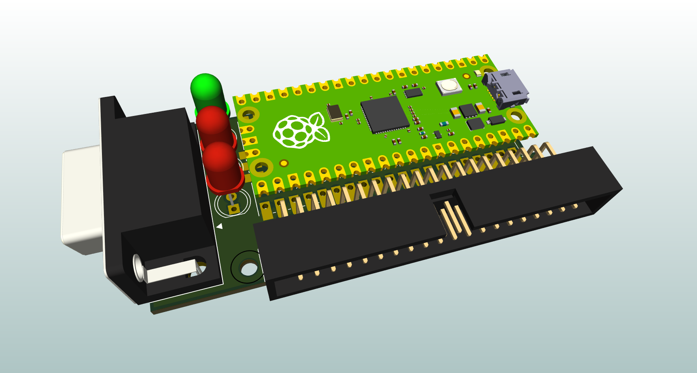
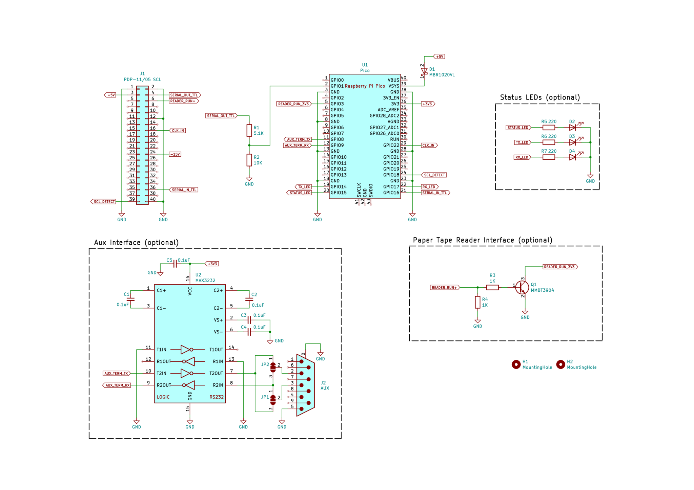

# PDP-11/05 Console Adapter

The *PDP-11/05 Console Adapter* is a TTL serial interface designed for use with the [PDP-11/05](http://gunkies.org/wiki/PDP-11/05) minicomputer. It provides both a USB and RS-232 serial interface to the PDP-11's console.  The project is based on the ubiquitous [Raspberry Pi Pico](https://www.raspberrypi.com/products/raspberry-pi-pico/) microcontroller.

The features of PDP-11/05 Console Adapter include:

- **Support for direct connection to the SCL connector on the back of the PDP-11/05**

- **USB-to-serial functionality, providing access to the PDP-11 console from a modern computer**

- **An external baud rate generator, allowing console baud rates higher than 2400**

- **Support for a range of baud rates (110 to 38400) and serial formats (8-N-1, 7-E-1, 7-O-1)**

- **An auxiliary RS-232 interface for connecting a real serial terminal**

- **A virtual paper tape reader compatible with the 11/05's READER RUN signal**

- **An M9301/M9312 console loader that can direcly load data into the PDP-11's memory using console commands**

This is Version 2 of the PDP-11/05 Console Adapter project.  An earlier version based on the Teensy 3.2 microcontroller can be found [here](https://github.com/jaylogue/pdp-1105-console-usb-adapter).

**[How it Works](#how-it-works)** 
&nbsp;&nbsp;&nbsp;&nbsp;&nbsp;&nbsp;&nbsp;&nbsp;**[Console Interface](#console-interface)** 
&nbsp;&nbsp;&nbsp;&nbsp;&nbsp;&nbsp;&nbsp;&nbsp;**[Auxiliary Terminal Interface](#auxiliary-terminal-interface)** 
&nbsp;&nbsp;&nbsp;&nbsp;&nbsp;&nbsp;&nbsp;&nbsp;**[Baud Clock Generation](#baud-clock-generation)** 
&nbsp;&nbsp;&nbsp;&nbsp;&nbsp;&nbsp;&nbsp;&nbsp;**[Host Selectable Data Rate / Serial Format](#host-selectable-data-rate--serial-format)** 
&nbsp;&nbsp;&nbsp;&nbsp;&nbsp;&nbsp;&nbsp;&nbsp;**[Status LEDs](#status-leds)** 
&nbsp;&nbsp;&nbsp;&nbsp;&nbsp;&nbsp;&nbsp;&nbsp;**[Power Source](#power-source)** 
&nbsp;&nbsp;&nbsp;&nbsp;&nbsp;&nbsp;&nbsp;&nbsp;**[Virtual Paper Tape Reader](#virtual-paper-tape-reader)** 
&nbsp;&nbsp;&nbsp;&nbsp;&nbsp;&nbsp;&nbsp;&nbsp;**[M9301/M9312 Console Loader](#m9301m9312-console-loader)** 
&nbsp;&nbsp;&nbsp;&nbsp;&nbsp;&nbsp;&nbsp;&nbsp;**[FLASH-based File Library](#flash-based-file-library)** 
&nbsp;&nbsp;&nbsp;&nbsp;&nbsp;&nbsp;&nbsp;&nbsp;**[XMODEM File Upload](#xmodem-file-upload)** 
**[Schematic](#schematic)** 
**[PCB Design Files](#pcb-design-files)** 
**[License](#license)** 

## How it Works

### Console Interface

At the most basic level, the Console Adapter operates as a TTL-serial interface, connecting the PDP-11's console (also known as the Serial Communication Line or SCL port) to one of the Pico's internal UARTs.  Level shifting circuitry in the adapter adjusts the PDP's 5V outputs to match the Pico's 3.3V inputs.  Using USB software on the Pico, the adapter appears as a virtual COM port when connected to a host computer via USB.  The adapter shuttles characters back and forth between the virtual COM port and the PDP-11's SCL port, making it possible to use a standard terminal program, such as minicom, picocom or PuTTY, to interact with the PDP's console.

In this way, the console adapter operates very similarly to an off-the-shelf USB-to-TTL serial device, with the exception that it’s behavior is fully customizable in software.

The Console Adapter supports standard serial data rates in the range accepted by the PDP-11 (110 to 38400 bps). Internally, the CPU in the PDP-11/05 is hard-wired to use the 8-N-1 serial format.  However, with appropriate software support on the PDP side, 7-E-1 or 7-O-1 formats can also be used (other formats are not available).  Based on this, the Console Adapter limits the choice of serial formats to these three combinations.

### Baud Clock Generation

The PDP-11/05 CPU includes a baud clock generator circuit which generates the 16X clock signal needed to drive the internal console UART chip.  Due to its simplicity, the internal generator limits the maximum data rate to 2400 bps.  Conveniently, the generator can be overridden by providing an external clock signal on the SCL connector, allowing the system to run at substantially higher speeds; theoretically up to 40000 bps.

To enable higher data rates, the Console Adapter employs a PWM on the Pico to generate the necessary clock signal to drive the PDP’s UART.  The frequency of this clock signal is automatically adjusted to match the data rate of the Pico's UART, ensuring that the two systems are always in sync.

### Auxiliary Terminal Interface

In addition to the host USB interface, the Console Adapter provides a second interface which can be used to connect a traditional serial terminal such as a VT-100.  An RS-232 level shifter (MAX3232) is used to convert the signals to standard EIA levels, allowing most terminals of the era to be used.  When connected, the terminal functions as an additional console for the PDP-11.

The auxiliary terminal interface can be used at the same time as the USB host interface.  When operated this way, characters typed on either the host computer or the auxiliary terminal are forwarded to the PDP-11, and characters output by the PDP-11 appear simultaneously on both.  It is also possible to use the Console Adapter with just an auxiliary terminal connected (i.e. without a host USB connection).

The data rate and serial format for the auxiliary terminal interface can be set independently from the that of the SCL port. (In general, though, its best to keep the data rates the same or similar between the two).

### Host Selectable Data Rate / Serial Format

The Console Adapter appears to the host computer as a standard USB COM device.  As such, it is able to receive standard requests from the host computer to change the serial configuration.  This makes it possible to adjust the adapter's serial data rate and format directly from terminal software running on the host.

When the Console Adapter receives a serial configuration message it adjusts the configuration of the console UART and baud clock generator to match the requested data rate and serial format.  Serial configuration changes happen on the fly and can be made at any time.  If desired, the auxiliary terminal interface can also be set to automatically adjusted to the new configuration.

The choice to dynamically adjust the serial configuration based on a request from the host can be enabled or disabled independently for both the SCL and auxiliary terminal interfaces.  When this feature is disabled, the serial configuration is controlled by a setting in the Console Adapter's settings menu.  These settings are persisted in FLASH and survive adapter reboots.

### Status LEDs

The PDP-11/05 Console Adapter has three status LEDs: The Power/Activity LED lit while the system is powered and flashes briefly whenever there is activity in the Console Adapter.

The TX and RX LEDs are normally off, and flash on whenever characters are transmitted or receive (respectively) by the PDP-11.

### Power Source

The Console Adapter operates on +5 volts, which it can receive either from the PDP-11/05 itself or via the USB port. Because the Console Adapter can get its power directly from the PDP, it is possible to use the Console Adapter with only an auxiliary terminal connected, and without a USB connection to a host computer.

Both power sources can be active at the same time, and the USB port can be connected or disconnected on the fly. (**_Do not_** hot plug/unplug the Console Adapter to the 11/05's SCL port, as it is not designed to support this).

_**CAUTION**: The Console Adapter is not internally isolated.  As a consequence, when the adapter is connected to both the PDP-11 and a host computer via USB, the grounds of the two systems are electrically connected.  To avoid ground potential differences, ensure that both the PDP and the host computer are connected to the same power circuit and that both systems are properly earth grounded._

### Virtual Paper Tape Reader

The PDP-11/05 SCL port includes a signal called "READER RUN" which is designed to drive a low-speed paper tape reader attached to the console device (e.g. an [ASR-33](https://en.wikipedia.org/wiki/Teletype_Model_33)). Whenever the PDP asserts the "READER RUN" signal, the reader is expected to read one character from a mounted paper tape and send it to the computer. In the Console Adapter, the READER RUN signal drives a transistor whose output is fed to a GPIO pin on the Pico.  Software on the Pico detects READER RUN transistions and uses this to emulate the behavior of a legacy tape reader.

Users can mount paper tape images on the virtual paper tape reader using the Console Adapter's menu system (accessed by typing a special _menu_ key on the console).  While the tape reader is active, a visual progress bar is displayed showing how much of the tape image has been read.

### M9301/M9312 Console Loader

On systems equiped with an M9301 or M9312 Bootstrap Module, the PDP-11/05 Console Adapter can be used to load data files directly into the PDP's memory using the bootstrap module's console UI.  Data is loaded by issuing a series of Load Address (L) and Deposit (D) commands and monitoring the responses received from the console.  The loader automatically detects data files in Absolute Loader (LDA) format and loads their contents at the correct memory locations.

The loader includes special support for loading the PDP-11 Bootstrap Loader (the code for which is built in to the Console Adapter firmware).  When invoked, the console adapter will prompt the user for the memory size of the machine and adjust the Bootstrap Loader's load address and contents automatically, as specified in the DEC documentation.

A similar feature is available for loading the Absolute Loader, which allows for bypassing the Bootstrap Loader step completely.

### FLASH-based File Library

Frequently used paper tape images, along with other types of data files, can be stored in the Pico's FLASH memory such that they are readily available for use when working the PDP-11.  A python-based command line tool is provided that gathers together a set of data files into a .uf2 file which then can be written to FLASH using one of the standard firmware update processes (e.g. by dragging it onto the Pico's virtual disk).  Once programmed into FLASH, the files are available for mounting on the virtual paper tape reader, or loading directly into memory using the M9301/M9312 console loader feature.

Half of the Pico's FLASH memory (1MiB) is reserved for file storage.  Any number of files may be stored in this memory, with each file consuming a maximum of 64KiB.

### XMODEM File Upload

In addition to files stored in FLASH, data files can be uploaded to the Console Adapter using the XMODEM file transfer protocol.  Files can be uploaded either via the USB interface, or the auxiliary terminal (using appropriate XMODEM software on the sending side).  Once uploaded, a file can be used repeatedly for mounting on the virtual paper tape reader or loading via the console loader.

Uploaded files are stored in RAM on the Console Adapter and are limited to 64KiB in size.

## Schematic

The following diagram shows the schematic for the PDP-11/05 Console USB Adapter:

A PDF version of the schematic is available [here](pcb/pdp1105-console-adapter-v2-schematic.pdf).

Note that the Console Adapter schematic uses modern pin numbering for the console IDC connector (J1), rather than the archaic DEC letter-based scheme.  For a table showing the relationship between the two numbering schemes, see the following PDF: [pdp1105-scl-connector.pdf](docs/pdp1105-scl-connector.pdf).

## KiCad Design Files

A KiCad project containing the schematic and a layout file for a two-layer PCB is available is available in the [pcb](pcb) folder.

## License

The PDP-11/05 Console Adapter source code is licensed under the [Apache version 2.0 license](https://www.apache.org/licenses/LICENSE-2.0).

All documentation, including images, schematics, PCB designs and this README, are licensed under a [Creative Commons Attribution 4.0 International License](https://creativecommons.org/licenses/by/4.0/).
