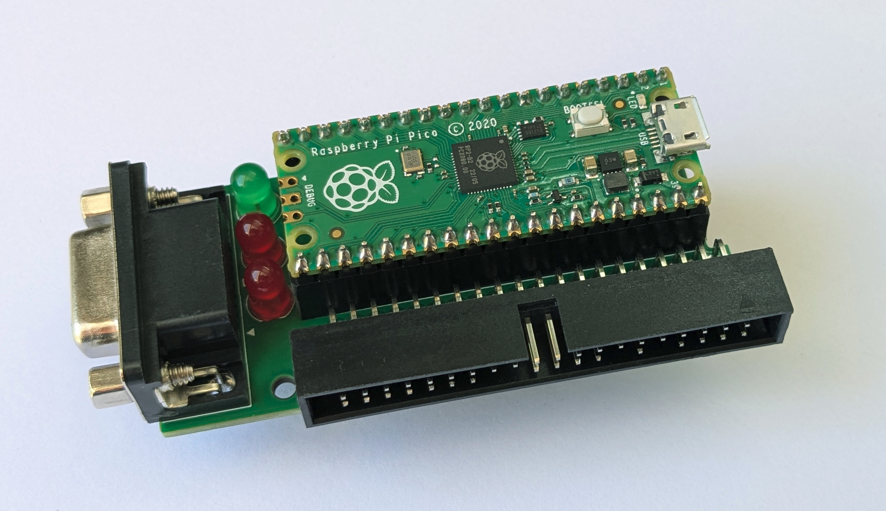
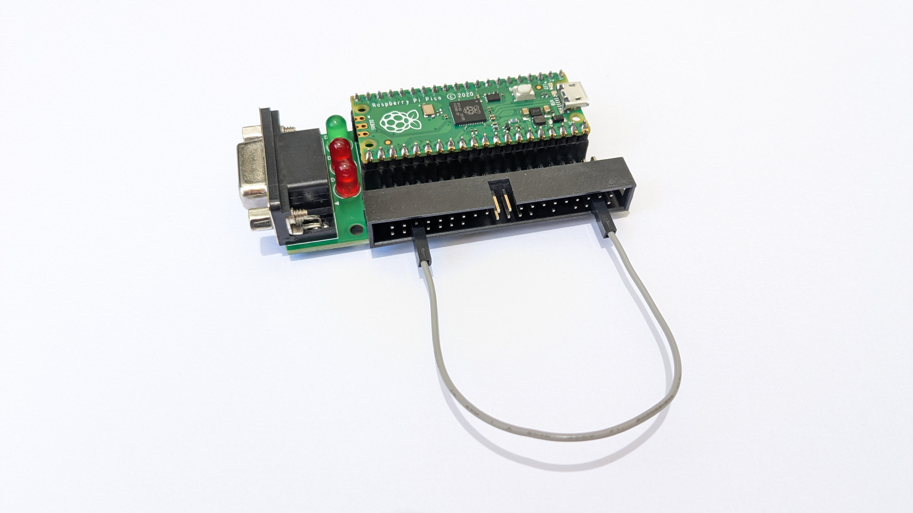

# PDP-11/05 Console Adapter User Manual

- [Introduction](#introduction)
- [Hardware Overview](#hardware-overview)
  - [Interface Ports](#interface-ports)
  - [Status LEDs](#status-leds)
- [Initial Setup](#initial-setup)
  - [Powering the Console Adapter](#powering-the-console-adapter)
  - [Connecting the Console Adapter to a PDP-11/05](#connecting-the-console-adapter-to-a-pdp-1105)
  - [Connecting to a USB Host Computer](#connecting-to-a-usb-host-computer)
  - [Connecting an Auxiliary Terminal](#connecting-an-auxiliary-terminal)
  - [Performing a Loop-back Test](#performing-a-loop-back-test)
  - [Updating the Console Adapter Firmware](#updating-the-console-adapter-firmware)
- [Basic Operation](#basic-operation)
  - [Terminal mode](#terminal-mode)
  - [Menu Mode](#menu-mode)
- [Virtual Paper Tape Reader](#virtual-paper-tape-reader)
  - [Mounting a Paper Tape Image](#mounting-a-paper-tape-image)
  - [Unmounting a Paper Tape Image](#unmounting-a-paper-tape-image)
  - [Viewing Status of the Paper Tape Reader](#viewing-status-of-the-paper-tape-reader)
- [M9312/M9301 Console Loader](#m9312m9301-console-loader)
  - [Loading Absolute Loader (LDA) Files](#loading-absolute-loader-lda-files)
  - [Loading Simple Data Files](#loading-simple-data-files)
  - [Loading the Bootstrap Loader](#loading-the-bootstrap-loader)
  - [Loading the Absolute Loader](#loading-the-absolute-loader)
- [Adapter Settings](#adapter-settings)
  - [Changing the SCL Port Configuration](#changing-the-scl-port-configuration)
  - [Default SCL Port Configuration](#default-scl-port-configuration)
  - [Changing the AUX Port Configuration](#changing-the-aux-port-configuration)
  - [Controlling the Paper Tape Progress Bar](#controlling-the-paper-tape-progress-bar)
- [Adapter Status](#adapter-status)
- [Flash File Library](#flash-file-library)
  - [Creating a File Library Image](#creating-a-file-library-image)
  - [Flashing a New File Library](#flashing-a-new-file-library)

---

## Introduction



The PDP-11/05 Console Adapter is a serial interface adapter for the console of a [PDP-11/05](http://gunkies.org/wiki/PDP-11/05) minicomputer. It connects to the PDP-11’s Serial Communication Line (SCL) port and makes it possible to communicate with the system over USB, using a terminal program running on a host computer. It also supports connecting a traditional RS-232 terminal.

## Hardware Overview

The Console Adapter hardware consists of a Raspberry Pi Pico microcontroller, a MAX3232 RS-232 driver/receiver and a small amount of support circuitry. Most of the functionality of the Console Adapter is embodied in the Pico microcontroller. The remaining circuitry is largely concerned with adapting Pico to the voltage levels used by the PDP-11 and external terminals.

### Interface Ports


The Console Adapter has 3 primary interfaces:

- **USB Port**: A female micro-USB connector for connecting to a host computer (located on the Pico micocontroller PCB).
- **SCL Port**: A 40pin IDC connector for connecting to the PDP-11/05's SCL port.
- **AUX port**: A female DE-9 connector for connecting an auxiliary RS-232 terminal.

Use of either the USB or AUX ports is optional.

### Status LEDs


The PDP-11/05 Console Adapter has three LEDs that show the status and activity of the system:

- **Power/Activity LED**: Lit while the system is powered. Flashes briefly whenever there is activity in the Console Adapter.
- **TX and RX LEDs**: Normally off. Flashes on whenever characters are transmitted/received by the PDP-11.

Additionally, the Pico's onboard LED mimics the behavior of the Power/Activity LED.

## Initial Setup

### Powering the Console Adapter

The Console Adapter operates on +5 volts. The adapter can receive power either directly from the PDP-11/05 or via a USB connection to a host computer. Both power sources can be active at the same time, and the USB port can be connected or disconnected on the fly while the adapter is connected to the PDP-11.

**CAUTION**: The same is not true for the SCP port. **Do not hot plug/unplug the Console Adapter to the 11/05**. It is not designed to support this.

### Connecting the Console Adapter to a PDP-11/05

The Console Adapter must be connected to the PDP-11/05 using a 40-pin ribbon cable with 2x20 pin IDC connectors at each end. Generally speaking, this cable should be as short as possible, for signal integrity reasons. However cables up to 6'/2m will probably work fine.

The SCP port on the PDP-11/05 predates modern connector standards. As such, it lacks the slot needed to accept the square registration "key" present on most modern ribbon cable connectors. Because of this, it is necessary to file off the registration key on one connector when making an SCL cable out of modern components.

**CAUTION**: The lack of the registration key on the SCL connector means that it is possible to connect the SCL cable to the PDP-11 in the wrong orientation. Therefore, **be especially careful to orient the SCL cable correctly when connecting it to the PDP-11**.  In particular, pin 1 on the SCL cable connector should be positioned such that it is towards to the right-hand side of the PDP-11 when looking at the system from behind. On most ribbon cables, pin 1 can be identified by the presence of a small triangle on one side of the connector, or by the red stripe on one edge of the ribbon cable.

### Connecting to a USB Host Computer

The primary means of interacting with the Console Adapter is via a USB connection to a host computer. This requires a cable with a micro USB connector on one end and either a USB A or USB C connector on the other end.

When connected via USB the Console Adapter appears as a virtual COM device on the host computer. To connect a terminal emulator to the COM device one must know the OS-specific device name, which varies depending what other devices are connected to the computer.

The following commands can be used to find the device name of the Console Adapter device:

- **Windows**:
  ```powershell
  powershell "Get-WmiObject Win32_SerialPort | Where-Object { $_.PNPDeviceID -match 'VID_2E8A' } | Select-Object DeviceID"
  ```

- **Linux**:
  ```bash
  ls -1 /dev/tty* | while read d; do [[ $(udevadm info $d | grep -i VENDOR_ID=2e8a) ]] && echo $d; done
  ```

- **macOS**:
  ```bash
  ioreg -rxlc IOUSBHostDevice | perl -ne '/"idVendor" = (.+)/ && ($v=$1); /"IOCalloutDevice" = "(.+)"/ && print "$1\n" if($v==11914)'
  ```

Once the device name is known, a terminal emulator program can be used to interact with the Console Adapter. Commonly used serial terminal programs include PuTTY (Windows), minicom (Linux, macOS), picocom (Linux, macOS), Serial (macOS) and ZOC (macOS).

When initially connecting a terminal program to the Console Adapter, it is suggested to set the program's serial configuration to 9600 bps, 8 data bits, no parity, 1 stop bit. This gives reasonable performance while being generally well supported by software running on the PDP-11.

Note that, for USB COM devices like the Console Adapter, the serial configuration set in the terminal program does not actually affect the way characters are communicated over the USB connection. Rather, changes to the serial configuration are forwarded over the USB connection to the USB device itself, where they are used to adjust the configuration of the serial link between the device and whatever system it is connected to. In the case of the Console Adapter, changing the configuration in the terminal program results in an adjustment to the serial configuration of the SCL port.

### Connecting an Auxiliary Terminal

It is possible to connect a standard RS-232 terminal (such as a classic DEC VT102) to the Console Adapter via its AUX port. An auxiliary terminal can be used in addition to, or instead of, a terminal emulator connected via the USB port.

The Console Adapter's AUX port uses a standard DE9 female connector, with connections for Transmit Data (TD), Receive Data (RD) and Ground (GND). There is no support for hardware flow control signals (as is typical of DEC serial ports of the era).

By default, the AUX port is configured as a DCE device, making it possible to use a standard "straight-through" serial cable when connecting the Console Adapter to most terminals.

A typical auxiliary terminal cable would be wired as follows:

| Terminal End<br/>(DB25 -M or -F) | Console Adapter End<br/>(DE9-M) | Signal |
|-----|-----|-----|
| 2   | 3   | TD  |
| 3   | 2   | RD  |
| 7   | 5   | GND |

If needed, the AUX port can be converted to a DTE configuration by changing jumpers JP1 and JP2 located on the underside of the Console Adapter PCB. This requires cutting the traces between pads 1 and 2 on both jumpers and creating a solder bridge between the other two pads. Note that, while this change is straightforward to do, it is likely easier to use a null-modem adapter, or a cable with null-modem wiring.

### Performing a Loop-back Test



To validate the functionality of the Console Adapter a simple loopback test can be performed while the adapter is disconnected from the PDP-11. This requires the use of a short jumper wire with a female pin connectors (sometimes called DuPont or Berg connectors) on each end.

- With the Console Adapter disconnected from the PDP-11, connect together **pin 4 and pin 36** on the SCL port connector.
- Plug the adapter into a host computer via USB.
- Start a terminal emulator program on the host computer and connect it to the Console Adapter.
- Type characters into the terminal program and observe that the characters are echoed back correctly.
- [Optional] Connect an auxiliary terminal to the AUX port, configured with the correct serial configuration. Verify correct echoing of characters via the auxiliary terminal.

### Updating the Console Adapter Firmware

The Console Adapter firmware can be updated by following the standard procedure for updating firmware on a Raspberry Pi Pico:

- Start with the Console Adapter in a powered-off state by powering off the PDP-11 (if attached) and disconnecting the USB connection to the host computer.
- While holding down the BOOTSEL button on the Pico, plug in the USB cable to the host computer.
- When the Pico virtual drive appears on the host computer (look for a drive named "RPI-RP2"), drag or copy the firmware image file (typically pdp1105-console-adapter.uf2) onto the drive.
- After a moment, the virtual drive will disappear and the Console Adapter will reboot
- Once the device finishes booting, the new firmware is installed and ready for use

Note that it is also possible to update the Console Adapter firmware using the Raspberry Pi [picotool](https://github.com/raspberrypi/picotool) command-line tool. This approach can be more convenient in that it does not require pressing the BOOTSEL button. Prebuilt binaries for the picotool command are available online at the [Pico SDK Tools](https://github.com/raspberrypi/pico-sdk-tools) github page.

To update the Console Adapter firmware using the picotool command, perform the following steps:

- Connect the Console Adapter to a host computer using a USB cable.
- At a command prompt, run the picotool command as follows, passing the pathname of the firmware image to be installed:
  ```bash
  picotool load output/pdp1105-console-adapter.uf2 -f
  ```
- After the command finishes, the Console Adapter will reboot. When finished the new firmware is installed and ready for use.

## Basic Operation

### Terminal mode

Upon boot, the Console Adapter automatically enters **Terminal Mode**. In Terminal Mode, the adapter continuously relays characters between USB port and PDP-11's SCL port: any characters input by the user via a terminal program on the host are sent to the PDP-11, and any characters output by the PDP-11 are displayed in the terminal program.

If an auxiliary terminal is connected to the AUX port, the adapter will also relay characters between the auxiliary terminal and the PDP-11. The USB and AUX ports can both be used simultaneously, and any characters output by the PDP-11 will be shown on both.

Characters are relayed transparently between the USB and AUX ports and the PDP-11's SCL port, with the sole exception of the character used to invoke Menu Mode (see below).

### Menu Mode

**Menu Mode** provides access to the various features of the Console Adapter, including mounting and unmounting virtual paper tapes, loading files via the M9312/M9301 console, changing adapter settings and viewing adapter status.

To enter Menu Mode from Terminal Mode press the menu key: *CTRL+^* (Control Shift 6). Upon entering Menu Mode, the adapter displays the Main Menu:

```txt
*** MAIN MENU:
  m) Mount paper tape           l) Load file using M93xx console
  u) Unmount paper tape         S) Adapter settings
  s) Adapter status             v) Adapter version
  -----
  ESC) Return to terminal mode  CTRL+^) Send menu character

>>>
```

While in Menu Mode, requests for user input are indicated by a `>>>` prompt. Menu choices are made by pressing the single (case sensitive) key shown before each menu option.

In most contexts, pressing *ESC* or *CTRL+C* will will exit menu mode and return the adapter to Terminal Mode.

Pressing *CTRL+^* from the Main Menu will send the menu key character to the PDP-11.

Menu Mode can be entered from either the USB port or the AUX port. The menu UI only displays on the port from which it was invoked.

## Virtual Paper Tape Reader

Console Adapter can emulate a low-speed paper tape reader attached to the PDP-11/05 console. Paper tape image files can be "mounted" on the virtual paper tape reader such that they are available to be read by the PDP-11. Each time the PDP-11 signals to advance the paper tape (via the READER RUN signal) the Console Adapter sends a single byte from the paper tape file to the SCL port. As the paper tape is read, an animated progress bar is displayed showing the logical position of the tape in the reader. When the entirety of the image has been read, the virtual paper tape is automatically unmounted.

The virtual paper tape reader can mount image files that have been stored in the adapter's flash File Library. It is also possible to mount image files that have been uploaded using the XMODEM protocol and stored in RAM.

Note that the mount status of the virtual paper tape reader, and the logical position of the paper tape image, are *not* preserved across reboots of the Console Adapter.

### Mounting a Paper Tape Image

To mount a paper tape image, choose the **Mount paper tape** option from the Main Menu (key sequence *CTRL+^ m*). This will show Mount Paper Tape menu:

```
*** MOUNT PAPER TAPE:
0) PDP-11 BASIC                3) XXDP D1AA ADDRESS TEST UP
1) CONSOLE ECHO TEST           4) XXDP DZQKC INSTRUCT EXERCISER
2) SIMPLE MEMORY TEST          5) TU58 BOOTSTRAP
-----
A) Absolute Loader             P) Previously uploaded file
X) Upload file via XMODEM      ESC) Return to terminal mode

>>> 
```

The first half of the menu shows the files stored in the device's File Library. To choose these, press the associated option key.

In the second half of the menu, the **Absolute Loader** option (key sequence *CTRL+^ m A*) can be used to mount a copy of the Absolute Loader paper tape image.

Select the **Upload file via XMODEM** option (key sequence *CTRL+^ m X*) to mount a tape image uploaded from a terminal program using the XMODEM protocol.

To mount a file that had been uploaded previously via XMODEM, select the **Previously uploaded file** option (key sequence *CTRL+^ m P*). Note that this option will not appear if no file has been uploaded.

When a paper tape image is mounted, any previously mounted tape image is unmounted first.

Once a selection is made, the Console Adapter returns to Terminal Mode.

### Unmounting a Paper Tape Image

The currently mounted paper tape image can be unmounted using the **Unmount paper tape** option from the Main Menu (key sequence *CTRL+^ u*).

If there is no paper tape mounted, choosing this option has no effect.

### Viewing Status of the Paper Tape Reader

To view the status of the paper tape reader choose the **Adapter status** option from the Main Menu (key sequence *CTRL+^ s*). The status shows the name of the paper tape image that is currently mounted (if any) and the current position of the tape in the virtual paper tape reader.

## M9312/M9301 Console Loader

If the PDP-11 contains a [M9312](https://gunkies.org/wiki/M9312_ROM) or [M9301](https://gunkies.org/wiki/M9301_ROM) Bootstrap Terminator module, the Console Adapter can load programs or other data directly into the memory of the PDP-11/05 using the UI provided by the module’s console ROM.

The Console Loader feature works by issuing a series of Load Address (L) and Deposit (D) commands to the console and monitoring the responses. The Console Adapter automatically detects data files in Absolute Loader (LDA) format and arranges to load their contents at the correct memory offsets.

The Console Adapter includes special support for loading the PDP-11 Bootstrap Loader (as described below). A similar feature is available for loading the Absolute Loader, which allows for bypassing the Bootstrap Loader step completely (also described below).

### Loading Absolute Loader (LDA) Files

To load an Absolute Loader (LDA) file, select the **Load file using M93xx console** option from the Main Menu (key sequence *CTRL+^ l*). This will show Load File menu:

```
*** LOAD FILE:
0) PDP-11 BASIC                3) XXDP D1AA ADDRESS TEST UP
1) CONSOLE ECHO TEST           4) XXDP DZQKC INSTRUCT EXERCISER
2) SIMPLE MEMORY TEST          5) TU58 BOOTSTRAP
-----
A) Absolute Loader             P) Previously uploaded file
B) Bootstrap Loader            ESC) Return to terminal mode
X) Upload file via XMODEM

>>> 
```

Once a file has been selected, the Console Adapter will inspect the file to determine if it is in Absolute Loader (LDA) format. If it is, the adapter will use the addressing information encoded in the file to store the file's contents into the correct locations in memory.

If the file contains a program start address, the start address will be loaded into console using the 'L' command as the final step of the loading process. This makes it convenient to start the program by entering an 'S' command.

Once the load operation has completed, the Console Adapter returns to Terminal Mode.

### Loading Simple Data Files

Loading a simple (non-LDA) data file is similar to loading an LDA file. Select the **Load file using M93xx console** option from the Main Menu (key sequence *CTRL+^ l*), which will show Load File menu:

```
*** LOAD FILE:
0) PDP-11 BASIC                3) XXDP D1AA ADDRESS TEST UP
1) CONSOLE ECHO TEST           4) XXDP DZQKC INSTRUCT EXERCISER
2) SIMPLE MEMORY TEST          5) TU58 BOOTSTRAP
-----
A) Absolute Loader             P) Previously uploaded file
B) Bootstrap Loader            ESC) Return to terminal mode
X) Upload file via XMODEM

>>> 
```

If the file selected is a simple data file, the Console Adapter will prompt to enter a load address:

```
>>> INPUT LOAD ADDRESS (in octal) : 0
```

Pressing ENTER without entering an address will select the default load address, as shown in the input field.

Once an address has been entered, the Console Adapter will load the contents of the data file into memory starting at the specified address. When the load operation completes, the Console Adapter returns to Terminal Mode.

### Loading the Bootstrap Loader

The Console Adapter provides a special option for loading the [PDP-11 Bootstrap Loader](https://gunkies.org/wiki/PDP-11_Bootstrap_Loader) via the M9312 / M9301 console ROM. This feature can be used to avoid the need to toggle the loader into the system using the console switches.

To load the Bootstrap Loader, select the **Load file using M93xx console** option from the Main Menu and choose the **Bootstrap Loader** option (key sequence *CTRL+^ l B*).

The Console Adapter will then prompt for the system memory size:

```
>>> INPUT SYSTEM MEMORY SIZE (in KW): 28
```

Enter the system memory size in KW, using decimal notation. Pressing ENTER without entering a size will select the default memory size, as shown in the input field.

Per the DEC instructions for using the Bootstrap Loader, the selected memory size determines the address at which the loader is loaded, as shown in the follow table:

| System Memory Size | Bootstrap Location |
|:-----:|:-----:|
| 4KW  | 017744 |
| 8KW  | 037744 |
| 12KW | 057744 |
| 16KW | 077744 |
| 20KW | 117744 |
| 24KW | 137744 |
| 28KW | 157744 |

Once a memory size has been entered, the Console Adapter proceeds to load the Bootstrap Loader at the given memory location. As it does so, it automatically adjusts the contents of the loader for operation at the target memory location, as described in the associated DEC documentation.

As the final step of loading, the Console Adapter loads the start address of the Bootstrap Loader into console using the 'L' command, allowing the user to start the loader using the 'S' command.

Note that, by design, the Bootstrap Loader expects to read the Absolute Loader from the system's tape reader. Therefore it is best to mount the Absolute Loader tape image prior to starting the Bootstrap Loader.

By default, the Bootstrap Loader is configured to read data from a low-speed paper tape reader attached to the PDP-11/05's SCL port (which in this context is the Console Adapter itself). This can be changed by modifying the paper tape reader CSR address stored in the last word of the Bootstrap Loader. See [here](https://gunkies.org/wiki/PDP-11_Bootstrap_Loader) or the associated DEC documentation for how to do this.

Note that, while traditionally, the Bootstrap Loader is used as the first step in loading programs via paper tape, with the Console Adapter, this step can be skipped by loading the Absolute Loader directly, as described in the following section.

### Loading the Absolute Loader

The Console Adapter provides the ability to load the PDP-11 Absolute Loader directly into memory using the M9312 / M9301 console.  This makes it possible to bypass the step of entering and running the Bootstrap Loader. Technically, when operated this way, the Console Adapter loads both Absolute Loader and the Bootstrap Loader in one step. This ensures that system memory is arranged the same as if the Boot Loader had been loaded as a separate step.

To load the Absolute Loader directly, select the **Absolute Loader** option from the Load File Menu(key sequence *CTRL+^ l A*). Once selected, the Console Adapter will prompt for the system memory size:

```
>>> INPUT SYSTEM MEMORY SIZE (in KW): 28
```

Enter the system memory size in KW, using decimal notation. Pressing ENTER without entering a size will select the default memory size, as shown in the input field.

As with loading the Bootstrap Loader, the selected memory size determines the address at which the absolute loader is loaded (see the section on Loading the Bootstrap Loader for details).

As the final step of loading, the Console Adapter loads the start address of the Absolute Loader into the console using the 'L' command. This allows the user to start the loader using the 'S' command.

When the Absolute Loader starts, it expects to read a paper tape in LDA format from the system's tape reader. Therefore it is best to mount the desired tape image prior to starting the loader.

## Adapter Settings

The Console Adapter provides a number of options for controlling its behavior. To view or change the adapter's settings, select **Adapter settings** from the Main Menu (key sequence *CTRL+^ S*). This will display the Settings Menu:

```
*** SETTINGS MENU:
s) Default SCL config....9600-8-N-1    a) Default Aux config....9600-8-N-1
S) SCL follows USB..........off        A) Aux follows USB..........off
p) Show PTR progress........on
-----
ESC) Return to terminal mode

>>> 
```

Changes made to settings via the settings menu are persisted in the adapter's flash memory and therefore are retained across power cycles.

### Changing the SCL Port Configuration

The console adapter includes a baud clock generator which allows it to dynamically adjust the speed of the PDP-11/05's SCL port. While in Terminal Mode, the adapter listens for requests from the attached USB host to change the serial configuration. These requests are known as *CDC Line Coding Requests* in USB parlance. Most terminal emulator programs, such as PuTTY or minicom, provide a way to send serial configuration requests using a key sequence or menu option.

When the adapter receives a serial configuration change request, it automatically adjusts the SCL port to match the requested configuration, provided the request is for a configuration supported by the PDP-11/05. The console adapter supports all standard serial bit rates in the range 110 to 38400 (which is effectively the range supported by the PDP-11/05 UART hardware). Serial bit formats are limited to 8-N-1, 7-E-1 and 7-O-1, as these are the only ones that may be used on the PDP-11/05.

Note that most terminal emulators will issue a request to change the serial configuration as soon as they connect to a USB COM device. The effect of this is that the SCL port's configuration will snap to whatever configuration is the default for the terminal emulator at the time it is started.

By default, the console adapter is pre-configured to listen and react to serial change requests from the USB host. This feature can be disabled by changing the **SCL follows USB** setting to **off** in the **Settings Menu** (key sequence: *CTRL+^ S S*). When this setting is off, the adapter will always use the default SCL port configuration set in the Settings Menu (see below).

### Default SCL Port Configuration

If there is no USB connection when the Console Adapter boots, the adapter will configure the SCL port using default settings stored in its persistent memory. This allows the selection of a particular serial configuration without needing to attach a USB host (e.g., when using the adapter with an auxiliary terminal only).

The default SCL configuration is preset to 9600-8-N-1, which is a reasonable configuration for most PDP-11 software.

The default configuration can be changed by selecting the **Default SCL config** option in the **Settings Menu** (key sequence: *CTRL+^ S s*). This will display the Port Configuration Menu:

```
*** CHANGE SCL PORT CONFIG:
0) 110    3) 1200   6) 9600
1) 300    4) 2400   7) 19200
2) 600    5) 4800   8) 38400
-----
a) 8-N-1  b) 7-E-1  c) 7-O-1
-----
ENTER) Accept    ESC) Abort

>>> 9600-8-N-1
```

The current serial configuration is shown after the prompt. Selecting the various menu options will adjust the bit rate and/or serial format accordingly. Pressing *ENTER* will accept the new configuration, while pressing *ESC* will discard it.

### Changing the AUX Port Configuration

When the Console Adapter boots, it configures the AUX port using a set of default settings stored in persistent memory. These settings can be changed by choosing the **Default AUX config** option from via the adapter's Settings Menu (key sequence: *CTRL+^ S a*).

The AUX port configuration is preset to 9600-8-N-1.

Similar to the SCL port, the AUX port can be configured to automatically adjust its serial configuration to match the configuration requested by an attached USB host. This feature is disabled by default, as most serial terminals cannot dynamically adapt their serial configuration on the fly. To enable automatic adjustment of the AUX port configuration, change the **AUX follows USB** setting to **on** in the Settings Menu (key sequence: *CTRL+^ S A*).

### Controlling the Paper Tape Progress Bar

Whenever the PDP-11 request a character from the virtual paper tape reader, the Console Adapter shows an animated progress bar depicting the logical position of the paper. This animation can be controlled by selecting the **Show PTR progress** option in the Settings Menu (key sequence: *CTRL+^ S p*). Three modes are available:

```
*** SHOW PAPER TAPE READER PROGRESS BAR:
0) On
1) USB only
2) Off

>>> 
```

**On** enables displaying the progress bar in all contexts, while **Off** disables it entirely.

**USB only** causes the progress bar to be displayed only when the user is interacting with the Console Adapter over USB (i.e. when not interacting via auxiliary terminal). This mode can be useful when the AUX port is configured to use a slow bit rate that interferes with the smooth animation of the bar.

## Adapter Status

The current status of the Console Adapter can be view by selecting the **Adapter status** option from the Main menu (key sequence: *CTRL+^ S S*). The adapter status feature displays the current state of the SCL and AUX ports, as well as the virtual paper tape reader.

```
*** ADAPTER STATUS:
SCL Port: 9600-8-N-1 (default), connected
Aux Port: 9600-8-N-1 (default)
Paper Tape Reader: PDP-11 BASIC (AJPB-PB)
Position: 9300/10170 (91%)
```

For both the SCL and AUX ports, the display shows the currently active serial configuration and an indication of how this configuration was arrived at. The word **default** is shown if the port configuration was set based on the defaults given in the Adapter Settings menu. The words **set via USB** are shown if the port configuration was set via a serial configuration change request received over USB.

For the SCL port, the words **connected** or **disconnected** will appear indicating whether the Console Adapter detects an electrical connection with the PDP-11's SCL port.

For the virtual paper tape reader, the adapter will show the name of the currently mounted paper tape image, or **No tape mounted**. If a tape is mounted, the adapter will show the logical position of the tape as a byte offset relative to the total size (e.g. *9300/10170*) as well as a percentage.

## Flash File Library

The Console Adapter provides the ability to store frequently used paper tape images and other data files on the Console Adapter itself, such that they are readily available for use when working with the PDP-11. Files are stored in the Pico's flash memory along side the adapter's firmware, and thus are preserved across reboots. The files in the file library appear as choices in the Mount Paper Tape and Load File menus.

Each file in the library can be up to 128KiB in size. The library itself can contain a maximum of 36 files totaling up to 1MiB in size.

File names are limited to 32 characters.

### Creating a File Library Image

To update the file library on the Console Adapter, one must first create a **file library image**. A file library image is a [UF2](https://github.com/microsoft/uf2) file that contains the contents of all the files in the library along with associated metadata (file names, sizes and checksums). Being a UF2 file, the library image file can be written directly to the Pico's flash memory using the standard Pico flash procedure (see below).

The `mkfilelib.py` command-line tool can be used construct a new file library image. The tool takes the name of the image file to be created, followed by a list of files to be included in the image:

```bash
./tools/mkfilelib.py my-file-lib.uf2 paper-tape/DEC-11-AJPB-PB.ptap paper-tape/DEC-11-ASPA-PB.ptap
```

When presented in a menu, files in the file library appear in the order they are listed on the command line, and use the given file name, excluding any path component:

```
*** MOUNT PAPER TAPE:
  0) DEC-11-AJPB-PB.ptap        1) DEC-11-ASPA-PB.ptap
  -----
  A) Absolute Loader            ESC) Return to terminal mode
  X) Upload file via XMODEM

>>> 
```

File names longer than 32 characters are silently truncated when generating a library image.

### Flashing a New File Library

Once a new file library image has been created, the process to flash the library onto the Console Adapter is the same as updating the adapter's firmware:

- Start with the Console Adapter in a powered-off state by powering off the PDP-11 (if attached) and disconnecting the USB connection to the host computer.
- While holding down the BOOTSEL button on the Pico, plug in the USB cable to the host computer.
- When the Pico virtual drive appears on the host computer (look for a drive named "RPI-RP2"), drag or copy the library image file (.uf2 file) onto the drive.
- After a moment, the virtual drive will disappear and the Console Adapter will reboot.
- Once the device finishes rebooting, the new file library is available for use.
